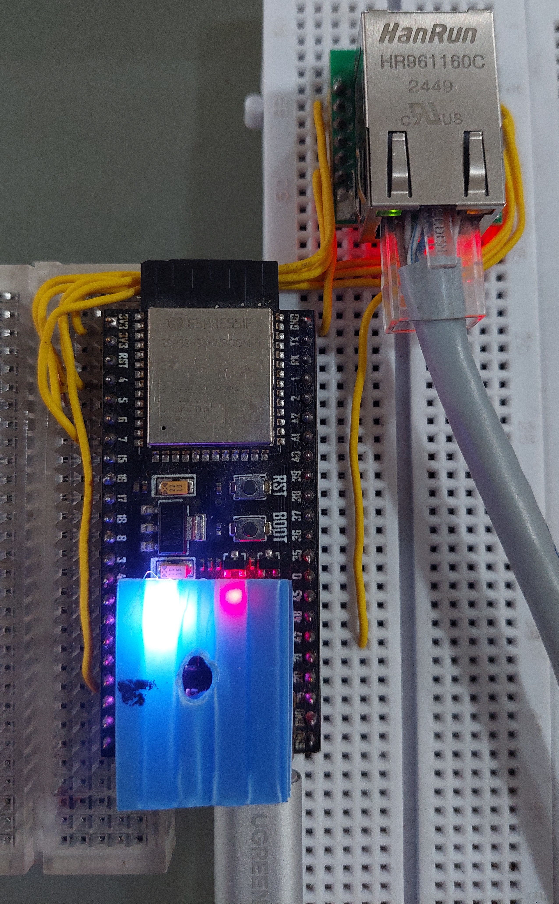

# esp32s3-w5500-idf  
  
## Required IDF version  
idf-version: '>=4.1.0'  
dependencies: espressif/w5500: ^1.0.1  
  
## Hardware  
Microcontroller: ESP32-S3-N16R8  
Ethernet Module: W5500  
  
## Pin Configuration  
| W5500    | ESP32-S3 |
|----------|----------|
| PIN_CS   | 4        |
| PIN_MOSI | 5        |
| PIN_SCLK | 6        |
| PIN_MISO | 7        |
| PIN_RST  | 14       |
| PIN_INT  | -1       |
  
## Circuits  
<figure>  
    
  <figcaption>  
    Figure 1. Circuit diagram showing the connection between the microcontroller and Ethernet module    
  </figcaption>  
</figure>  
  